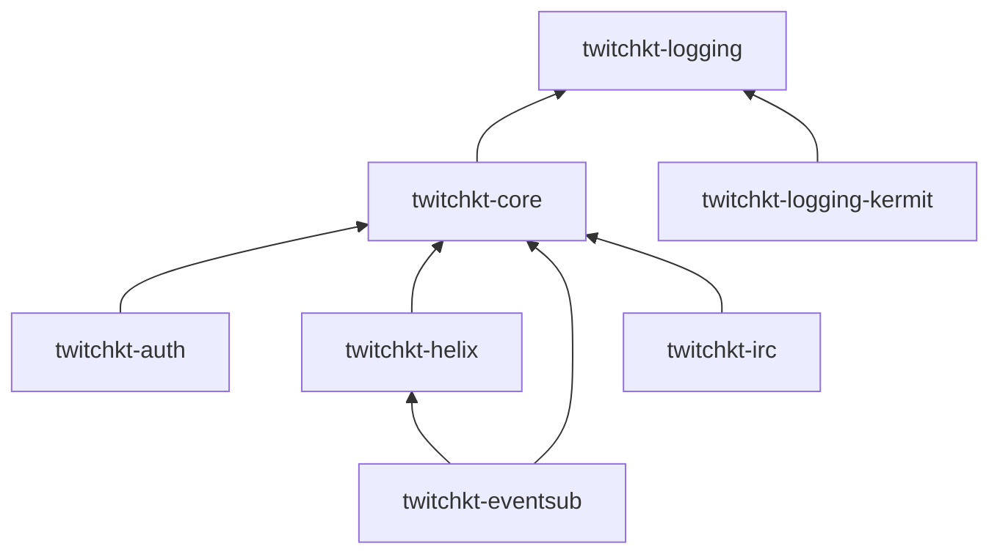
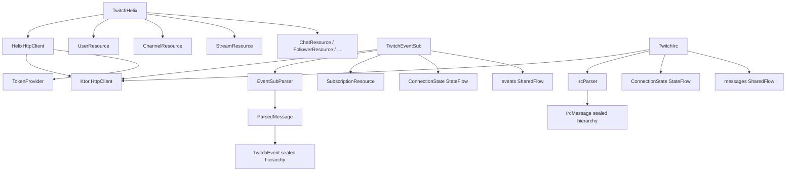

# TwitchKt

Kotlin Multiplatform Twitch API library. Provides typed, coroutine-native clients for Twitch OAuth2, Helix REST API, EventSub WebSocket, and IRC.

## Features

- Kotlin Multiplatform (JVM, JS, Wasm, Native targets via `commonMain`). The JVM target bundles Ktor CIO as its engine; JS/Wasm consumers must supply their own Ktor engine (e.g. `ktor-client-js`).
- Typed suspend functions for all Helix endpoints
- `Flow`-based cursor pagination — emit all pages without manual cursor management
- EventSub WebSocket with automatic reconnect and keepalive management
- OAuth2 Authorization Code flow — authorization URL, code exchange, token refresh, validation
- Pluggable `TokenProvider` — supply tokens lazily at call time (supports rotation)
- Pluggable `TwitchKtLogger` — bridge to any logging framework
- Opt-in `ScopeProvider` for proactive scope validation before requests
- `@RequiresScope` annotations on methods that need specific OAuth scopes
- Typed `TwitchApiException` hierarchy with rate-limit retry-after support
- Twitch CLI-compatible URL overrides for local mock server testing

## Modules

| Module | Purpose |
|---|---|
| [`twitchkt-logging`](logging/) | `TwitchKtLogger` interface, `LogLevel` enum. Zero dependencies. |
| [`twitchkt-core`](core/) | Config (`TwitchKtConfig`), auth contracts (`TokenProvider`, `ScopeProvider`, `TwitchScope`), error hierarchy, shared enums |
| [`twitchkt-auth`](auth/) | OAuth2 flows — authorization URL, token exchange, refresh, validation |
| [`twitchkt-helix`](helix/) | Twitch Helix REST API client with 25 typed resource groups and pagination |
| [`twitchkt-eventsub`](eventsub/) | EventSub WebSocket client with 73 typed event models, reconnection logic |
| [`twitchkt-irc`](irc/) | Deprecated IRC client (retained for watch streaks only) |
| [`twitchkt-logging-kermit`](logging-kermit/) | `TwitchKtLogger` implementation backed by Kermit |
| [`twitchkt-bom`](bom/) | BOM/platform artifact for version alignment |

## Dependency Graph



## Getting Started

Import the BOM to align all module versions, then declare only the modules you need:

```kotlin
dependencies {
    implementation(platform("io.github.captnblubber:twitchkt-bom:VERSION"))

    implementation("io.github.captnblubber:twitchkt-core:VERSION")
    implementation("io.github.captnblubber:twitchkt-helix:VERSION")
    implementation("io.github.captnblubber:twitchkt-eventsub:VERSION")
    implementation("io.github.captnblubber:twitchkt-auth:VERSION")

    // Optional: Kermit logging bridge
    implementation("io.github.captnblubber:twitchkt-logging-kermit:VERSION")
}
```

With the BOM applied, individual module declarations do not need a version:

```kotlin
dependencies {
    implementation(platform("io.github.captnblubber:twitchkt-bom:1.0.0"))
    implementation("io.github.captnblubber:twitchkt-helix")
    implementation("io.github.captnblubber:twitchkt-eventsub")
}
```

## Quick Start

### Configuration

```kotlin
val config = TwitchKtConfig(
    clientId = "your_client_id",
    tokenProvider = { myTokenStore.getAccessToken() },
)

val httpClient = HttpClient(CIO) {
    install(ContentNegotiation) { json() }
    install(WebSockets)
}
```

### Helix API

```kotlin
val helix = TwitchHelix(httpClient, config)

// Get user info
val users = helix.users.getUsers(logins = listOf("captnblubber"))

// Check if a channel is live
val streams = helix.streams.getStreams(userLogins = listOf("captnblubber"))

// Update stream title (requires channel:manage:broadcast)
helix.channels.update(
    broadcasterId = "123456",
    request = UpdateChannelRequest(title = "New stream title"),
)

// Paginated endpoints return Flow — all pages fetched automatically
helix.followers.list(broadcasterId = "123456").collect { follower ->
    println(follower.userLogin)
}
```

### EventSub

```kotlin
val eventSub = TwitchEventSub(httpClient, config, helix.subscriptions)

eventSub.subscribe(EventSubSubscriptionType.ChannelFollow(broadcasterId, moderatorId))
eventSub.subscribe(EventSubSubscriptionType.StreamOnline(broadcasterId))
eventSub.connect(coroutineScope)

eventSub.events.collect { event ->
    when (event) {
        is ChannelFollow -> println("New follower: ${event.userName}")
        is ChannelSubscribe -> println("New sub: ${event.userName} tier ${event.tier}")
        is StreamOnline -> println("Stream started!")
        else -> { }
    }
}
```

### Authentication

```kotlin
val auth = TwitchAuth(httpClient, clientId = "your_client_id", clientSecret = "your_client_secret")

// Generate authorization URL
val url = auth.authorizationUrl(
    scopes = setOf(TwitchScope.CHAT_READ, TwitchScope.CHANNEL_READ_SUBSCRIPTIONS),
    redirectUri = "http://localhost:8080/callback",
)

// Exchange code for tokens
val tokens = auth.exchangeCode(code = "abc123", redirectUri = "http://localhost:8080/callback")

// Refresh when expired
val newTokens = auth.refresh(refreshToken = tokens.refreshToken)
```

### Error Handling

```kotlin
try {
    helix.channels.update(broadcasterId, request)
} catch (e: TwitchApiException.RateLimited) {
    delay(e.retryAfterMs)
} catch (e: TwitchApiException.Forbidden) {
    // missing OAuth scope
}
```

## Integration Tests

Integration tests run against Twitch CLI mock servers and are excluded from the normal test run.

**Prerequisites:** Install the [Twitch CLI](https://dev.twitch.tv/docs/cli/) and ensure it is on `$PATH`. Ports 8080 and 8081 must be free.

Start the mock API server:

```bash
twitch mock-api start
```

Then run the integration tests for the desired module:

```bash
# Helix integration tests
./gradlew :helix:jvmTest -DintegrationTest=true

# EventSub integration tests
./gradlew :eventsub:jvmTest -DintegrationTest=true
```

See the [eventsub](eventsub/) and [helix](helix/) module READMEs for details on what each suite covers.

## Architecture



## Dependencies

- `ktor-client-core` + `ktor-client-websockets` + `ktor-client-content-negotiation` — HTTP and WebSocket transport
- `ktor-client-cio` (JVM) — CIO engine
- `ktor-serialization-kotlinx-json` + `kotlinx-serialization-json` — JSON serialization
- `kotlinx-coroutines-core` — Structured concurrency and Flow
