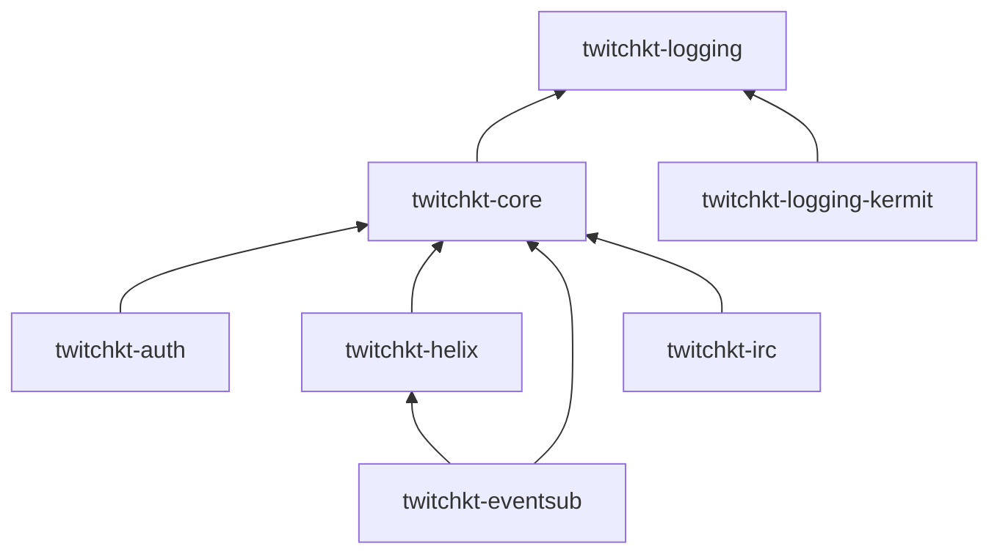
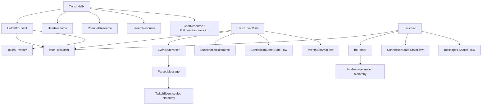

# TwitchKt

Kotlin Multiplatform Twitch API library. Provides typed, coroutine-native clients for Twitch OAuth2, Helix REST API, EventSub WebSocket, and IRC.

## Features

- Kotlin Multiplatform (JVM, JS, Wasm targets via `commonMain`)
- Typed suspend functions for all Helix endpoints
- `Flow`-based cursor pagination — emit all pages without manual cursor management
- EventSub WebSocket with automatic reconnect and keepalive management
- OAuth2 Authorization Code flow — authorization URL, code exchange, token refresh, validation
- Pluggable `TokenProvider` — supply tokens lazily at call time (supports rotation)
- Pluggable `TwitchKtLogger` — bridge to any logging framework
- Opt-in `ScopeProvider` for proactive scope validation before requests
- `@RequiresScope` annotations on methods that need specific OAuth scopes
- Typed `TwitchApiException` hierarchy with rate-limit retry-after support
- Twitch CLI-compatible URL overrides for local mock server testing

## Modules

| Module | Purpose |
|---|---|
| [`twitchkt-logging`](logging/) | `TwitchKtLogger` interface, `LogLevel` enum. Zero dependencies. |
| [`twitchkt-core`](core/) | Config (`TwitchKtConfig`), auth contracts (`TokenProvider`, `ScopeProvider`, `TwitchScope`), error hierarchy, shared enums |
| [`twitchkt-auth`](auth/) | OAuth2 flows — authorization URL, token exchange, refresh, validation |
| [`twitchkt-helix`](helix/) | Twitch Helix REST API client with 25 typed resource groups and pagination |
| [`twitchkt-eventsub`](eventsub/) | EventSub WebSocket client with 73 typed event models, reconnection logic |
| [`twitchkt-irc`](irc/) | Deprecated IRC client (retained for watch streaks only) |
| [`twitchkt-logging-kermit`](logging-kermit/) | `TwitchKtLogger` implementation backed by Kermit |
| [`twitchkt-bom`](bom/) | BOM/platform artifact for version alignment |

## Getting Started

TwitchKt uses [Ktor](https://ktor.io) for all HTTP and WebSocket communication. You provide the `HttpClient` so you stay in control of the engine, timeouts, and plugins — TwitchKt does not force a specific setup on you.

### 1. Add dependencies

Use the BOM to align all module versions, then declare the modules and Ktor plugins you need:

```kotlin
dependencies {
    // BOM — manages all twitchkt module versions
    implementation(platform("io.github.captnblubber:twitchkt-bom:VERSION"))

    // TwitchKt modules (no version needed with BOM)
    implementation("io.github.captnblubber:twitchkt-core")
    implementation("io.github.captnblubber:twitchkt-helix")       // Helix REST API
    implementation("io.github.captnblubber:twitchkt-eventsub")    // EventSub WebSocket
    implementation("io.github.captnblubber:twitchkt-auth")        // OAuth2 flows

    // Optional: Kermit logging bridge
    implementation("io.github.captnblubber:twitchkt-logging-kermit")

    // Ktor — pick an engine for your platform
    val ktorVersion = "3.x.x"
    implementation("io.ktor:ktor-client-cio:$ktorVersion")                        // JVM
    // implementation("io.ktor:ktor-client-js:$ktorVersion")                      // JS/Wasm

    // Ktor plugins required by TwitchKt
    implementation("io.ktor:ktor-client-content-negotiation:$ktorVersion")
    implementation("io.ktor:ktor-serialization-kotlinx-json:$ktorVersion")
    implementation("io.ktor:ktor-client-websockets:$ktorVersion")                 // EventSub only
}
```

### 2. Create an HttpClient

TwitchKt requires `ContentNegotiation` with JSON. If you use EventSub, also install `WebSockets`:

```kotlin
val httpClient = HttpClient(CIO) {
    install(ContentNegotiation) {
        json()
    }
    install(WebSockets)
}
```

### 3. Configure TwitchKt

```kotlin
val config = TwitchKtConfig(
    clientId = "your_client_id",
    tokenProvider = { myTokenStore.getAccessToken() },
)
```

The `tokenProvider` lambda is called on every request, so you can rotate or refresh tokens transparently without rebuilding the client.

## Quick Start

### Helix REST API

```kotlin
val helix = TwitchHelix(httpClient, config)
```

Fetch a user, check if a stream is live, or update channel info — all as typed suspend functions:

```kotlin
// Look up a user by login name
val users = helix.users.getUsers(logins = listOf("captnblubber"))

// Check if a channel is currently live
val streams = helix.streams.getStreams(userLogins = listOf("captnblubber"))

// Update the stream title (requires channel:manage:broadcast scope)
helix.channels.update(
    broadcasterId = "123456",
    request = UpdateChannelRequest(title = "New stream title"),
)
```

Paginated endpoints return a `Flow` — TwitchKt fetches subsequent pages automatically as you collect:

```kotlin
helix.followers.list(broadcasterId = "123456").collect { follower ->
    println(follower.userLogin)
}
```

### EventSub WebSocket

EventSub delivers real-time Twitch events over a managed WebSocket connection. Subscribe to the events you care about, connect, then collect from the `events` flow:

```kotlin
val eventSub = TwitchEventSub(httpClient, config, helix.subscriptions)

// Register subscriptions before connecting
eventSub.subscribe(EventSubSubscriptionType.ChannelFollow(broadcasterId, moderatorId))
eventSub.subscribe(EventSubSubscriptionType.StreamOnline(broadcasterId))

// Connect — manages keepalives and reconnects automatically
eventSub.connect(coroutineScope)

// All incoming events arrive on this flow as typed sealed classes
eventSub.events.collect { event ->
    when (event) {
        is ChannelFollow -> println("New follower: ${event.userName}")
        is ChannelSubscribe -> println("New sub: ${event.userName} tier ${event.tier}")
        is StreamOnline -> println("Stream started!")
        else -> { }
    }
}
```

### Authentication

If you need to handle the OAuth2 flow yourself rather than providing a static token:

```kotlin
val auth = TwitchAuth(httpClient, clientId = "your_client_id", clientSecret = "your_client_secret")

// Build the URL to redirect users to for authorization
val url = auth.authorizationUrl(
    scopes = setOf(TwitchScope.CHAT_READ, TwitchScope.CHANNEL_READ_SUBSCRIPTIONS),
    redirectUri = "http://localhost:8080/callback",
)

// Exchange the code Twitch returns for an access + refresh token pair
val tokens = auth.exchangeCode(code = "abc123", redirectUri = "http://localhost:8080/callback")

// Refresh when the access token expires
val newTokens = auth.refresh(refreshToken = tokens.refreshToken)
```

### Error Handling

All Twitch API errors are thrown as typed `TwitchApiException` subclasses:

```kotlin
try {
    helix.channels.update(broadcasterId, request)
} catch (e: TwitchApiException.RateLimited) {
    delay(e.retryAfterMs)
} catch (e: TwitchApiException.Forbidden) {
    // Missing OAuth scope — check @RequiresScope on the method
}
```

## Integration Tests

Integration tests run against Twitch CLI mock servers and are excluded from the normal test run.

**Prerequisites:** Install the [Twitch CLI](https://dev.twitch.tv/docs/cli/) and ensure `twitch` is on `$PATH`. Ports 8080 and 8081 must be free.

Start the mock API server in a separate terminal:

```bash
twitch mock-api start
```

Then run the integration tests for the desired module:

```bash
# Helix integration tests
./gradlew :helix:jvmTest -DintegrationTest=true

# EventSub integration tests
./gradlew :eventsub:jvmTest -DintegrationTest=true
```

See the [helix](helix/) and [eventsub](eventsub/) module READMEs for details on what each suite covers.

## Architecture

### Module Dependency Graph



### Internal Structure



## Dependencies

- `ktor-client-core` + `ktor-client-websockets` + `ktor-client-content-negotiation` — HTTP and WebSocket transport
- `ktor-serialization-kotlinx-json` + `kotlinx-serialization-json` — JSON serialization
- `kotlinx-coroutines-core` — Structured concurrency and Flow

## Support

If you find TwitchKt useful, the best way to support the project is to drop a follow on the Twitch channel where it was built — [twitch.tv/captnblubber](https://twitch.tv/captnblubber). If you have Amazon Prime, a free Prime sub goes a long way too.
